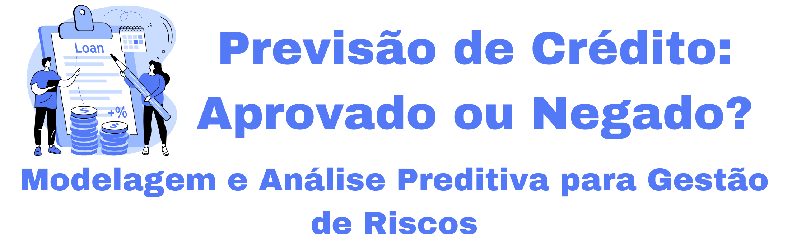
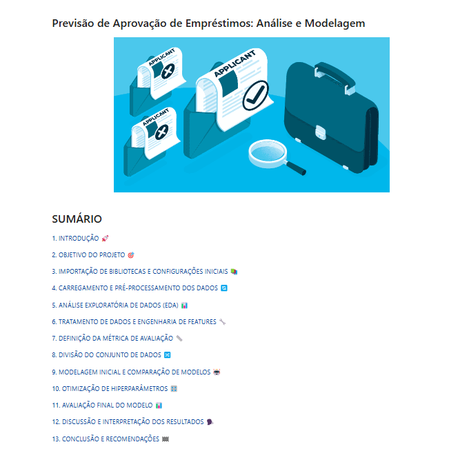
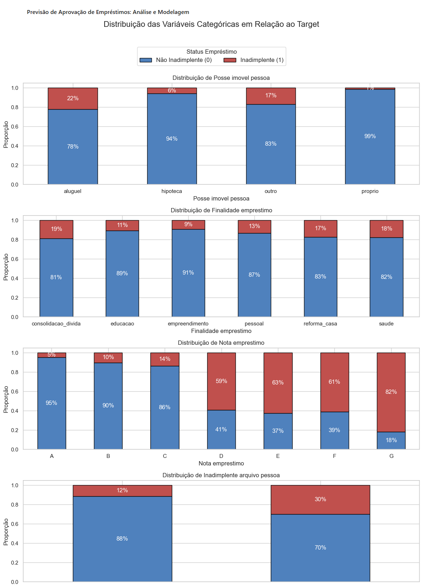

# 💳 Previsão de Aprovação de Empréstimos: Análise e Modelagem

## 📝 Descrição do Projeto  
Este projeto, desenvolvido no âmbito do módulo de **Machine Learning** do **Santander Coders 2024**, tem como objetivo aplicar técnicas de **análise exploratória de dados (EDA)** e **modelagem preditiva** para prever a aprovação ou negação de solicitações de empréstimo. Através de algoritmos de classificação, buscamos entender os fatores que influenciam a aprovação e identificar possíveis inadimplentes, ajudando instituições financeiras na gestão de risco.

As principais etapas deste projeto incluem:

1. **Análise Exploratória de Dados (EDA)**:  
   - Realizamos uma exploração aprofundada das variáveis no dataset para entender as distribuições, identificar padrões e descobrir correlações relevantes que pudessem influenciar na aprovação de empréstimos. Utilizamos visualizações e análises estatísticas para detectar outliers e variáveis significativas, o que ajudou a traçar um perfil dos solicitantes. A EDA foi essencial para estabelecer uma base sólida, garantindo que as escolhas de modelagem e pré-processamento fossem fundamentadas em uma compreensão completa dos dados. Essa etapa revelou insights valiosos, como fatores relacionados ao risco de inadimplência e características que poderiam influenciar a decisão de crédito.

2. **Modelagem Preditiva**:  
   - Com base na EDA, desenvolvemos e testamos uma gama de modelos de machine learning, incluindo **Random Forest** e **XGBoost**, focando em alcançar o melhor desempenho na previsão de aprovação e negação de empréstimos. Cada modelo foi cuidadosamente otimizado por meio de **GridSearchCV** e **RandomizedSearchCV**, com o objetivo de maximizar a precisão e o recall, especialmente para a classe de inadimplentes, que representa um risco para a instituição financeira. Esta etapa envolveu uma análise comparativa detalhada, permitindo-nos selecionar o modelo mais robusto, que equilibrou adequadamente a precisão com o recall, assegurando uma resposta confiável na classificação dos candidatos.

3. **Ajuste de Threshold**:  
   - Para maximizar a detecção de inadimplentes e reduzir o risco de falsos negativos, implementamos uma estratégia de ajuste de threshold no modelo final. Em vez de confiar no threshold padrão de 0.5, testamos valores menores, visando aumentar o recall da classe de inadimplentes sem comprometer significativamente a precisão. Esse ajuste foi essencial para tornar o modelo mais sensível a sinais de inadimplência, permitindo uma identificação mais eficaz de solicitantes com maior risco. O impacto do novo threshold foi monitorado de perto para garantir um equilíbrio ideal entre recall e o custo de potenciais falsos positivos, proporcionando uma solução que atende tanto à necessidade de segurança na detecção quanto à eficiência operacional.

Essas etapas foram cuidadosamente planejadas e executadas para criar um modelo preditivo que vai além da simples classificação. Com uma taxa de recall próxima a 90% para inadimplentes, o projeto oferece uma solução robusta para gestão de riscos e uma base confiável para decisões estratégicas na concessão de crédito. A abordagem detalhada e os ajustes de threshold mostraram-se fundamentais para atingir os resultados desejados, solidificando a eficácia do modelo em ambientes reais.

  

## 🗂️ Estrutura do Repositório
Este repositório está organizado da seguinte forma:
- **01_Base_de_Dados**: Contém os arquivos de dados brutos utilizados para análise.
- **02_Analise**: Contém o arquivo Jupyter com a análise e modelagem.
- **03_Recursos**: Contém recursos visuais utilizados no projeto.

## 🔍 Estrutura do Projeto

### Parte 1: Análise Exploratória de Dados (EDA)
- **Distribuição de Variáveis**: Análise da distribuição das principais variáveis do dataset, com foco na identificação de outliers e padrões de dados.
- **Correlação Entre Variáveis**: Identificação de correlações entre características que podem impactar na decisão de aprovação do empréstimo.
- **Análise de Outliers**: Exploração dos dados para identificar valores extremos que possam influenciar os resultados da modelagem.

### Parte 2: Modelagem Preditiva
- **Seleção de Modelos**: Teste de vários algoritmos de classificação, incluindo Random Forest, Decision Tree, e XGBoost.
- **Ajuste de Hiperparâmetros**: Otimização dos modelos para maximizar o desempenho, com foco no recall da classe de inadimplentes.
- **Ajuste de Threshold**: Modificação do threshold de decisão para melhorar a sensibilidade na detecção de inadimplentes.

## 💾 Demonstração e Uso
Para explorar a análise e a modelagem, você pode seguir uma das opções abaixo:

1. **Visualização Direta no GitHub**:
   - Vá até a pasta **02-Analise** e abra o arquivo **Jupyter Notebook** diretamente no GitHub para visualizar a análise sem precisar baixar.
   - [Clique aqui para acessar a pasta de análise](02-Analise/loan-approval-prediction.ipynb).

2. **Download do Notebook**:
   - Caso a visualização no GitHub não funcione adequadamente ou prefira trabalhar localmente, você pode baixar o arquivo que está no caminho anterior.

3. **Instruções de Uso Local**:
   - Após baixar, abra o notebook no Jupyter ou em uma plataforma que suporte notebooks IPython.
   - Execute as células sequencialmente para visualizar as análises e gráficos.

## 🛠️ Tecnologias Utilizadas
- [Python](https://www.python.org/)
- [Jupyter Notebook](https://jupyter.org/)
- [Pandas](https://pandas.pydata.org/)
- [Matplotlib](https://matplotlib.org/)
- [Seaborn](https://seaborn.pydata.org/)
- [Scikit-Learn](https://scikit-learn.org/)
- [XGBoost](https://xgboost.readthedocs.io/)

## 🏗️ Arquitetura e Fluxo de Análise

O fluxo de análise do projeto segue a estrutura abaixo:

1. **Coleta de Dados**: Importação do dataset com informações sobre os solicitantes de empréstimo.
2. **Manipulação e Limpeza de Dados**: Uso da biblioteca **Pandas** para preparar os dados, tratar valores ausentes e remover inconsistências.
3. **Visualização Gráfica**: Criação de visualizações com **Matplotlib** e **Seaborn** para entender a distribuição e os padrões dos dados.
4. **EDA**: Análise exploratória para compreender melhor as características e padrões do dataset.
5. **Modelagem e Ajustes**: Uso do Scikit-Learn e XGBoost para construir modelos preditivos e ajustar hiperparâmetros, visando otimizar a detecção de inadimplentes.
6. **Insights**: Interpretação dos resultados para gerar insights úteis para a tomada de decisão sobre a aprovação de empréstimos.

## 📈 Impacto e Resultados

- **Previsão Precisa de Inadimplência**: O projeto alcançou uma taxa de recall próxima de **90%** para a classe de inadimplentes, garantindo uma alta sensibilidade na detecção de clientes com potencial de inadimplência. Essa precisão minimiza significativamente o risco de falsos negativos, ajudando a instituição a tomar decisões mais seguras ao avaliar solicitações de crédito.

- **Aprimoramento na Gestão de Riscos**: Através da modelagem preditiva e da análise cuidadosa dos dados históricos, desenvolvemos uma ferramenta que fornece uma visão robusta sobre o risco de inadimplência dos candidatos. Com esse modelo, as instituições financeiras podem identificar, de forma mais eficiente, candidatos com maior propensão a inadimplência, otimizando a gestão de riscos e mitigando possíveis perdas financeiras.

- **Implementação de Técnicas Avançadas de Machine Learning**: O uso do ajuste de threshold no modelo **XGBoost** foi essencial para maximizar o recall da classe 1 (inadimplentes), sem comprometer a estabilidade do modelo. Essa abordagem sofisticada elevou o desempenho do modelo além dos métodos convencionais, garantindo uma maior segurança na identificação de inadimplentes e oferecendo um diferencial competitivo ao integrar uma estratégia de machine learning avançada na análise de crédito.

- **Contribuição para a Tomada de Decisões**: Ao oferecer uma solução preditiva com alta precisão e recall, o modelo proporciona às equipes de crédito uma ferramenta eficaz para apoio na tomada de decisões, permitindo a personalização de estratégias de concessão e, assim, promovendo uma maior estabilidade financeira. Esse projeto reflete o potencial transformador da ciência de dados no setor financeiro, onde a capacidade de prever e antecipar comportamentos de inadimplência é um ativo valioso.

Esses resultados reforçam o sucesso do projeto e demonstram que a combinação de técnicas avançadas de machine learning com a adaptação criteriosa dos thresholds de classificação pode atender, de forma eficaz, aos objetivos de redução de riscos e otimização de decisões em concessão de crédito.

## 🖼️ Screenshots
Aqui estão algumas capturas de tela das análises:

## 📞 Contato
- 📫 Você pode entrar em contato comigo pelo meu [e-mail](mailto:thiago.leit@hotmail.com).
- 💼 Meu perfil no [LinkedIn](https://www.linkedin.com/in/tnleite/) para acompanhar meu progresso e projetos.
- ✍🏻 Meu perfil no [Medium](https://medium.com/@thiago.leit) para ver artigos publicados.
- 🌐 Meu [Portfólio](https://thiagoleitedata.com.br) para visualizar outros projetos.

